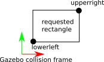
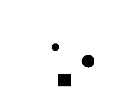

# Collision map creator plugin

This is a fork of Julian Exner's [collision\_map\_creator\_plugin](https://bitbucket.org/jexner/collision_map_creator_plugin/overview) (originally forked from Stephen Brawner's [collision\_map\_creator\_plugin](https://bitbucket.org/brawner/collision_map_creator_plugin) for Gazebo with the major difference that you can choose which entity to treat as ground (useful for table-top robotics), e.g. by speciying collision entity or setting a minimum height.

## How to compile

```
mkdir build
cd build
cmake ..
make
```

## How to use

### Add the plugin to your world file

```
    ...
    <plugin filename="libcollision_map_creator.so" name="collision_map_creator"/>
  </world>
</sdf>
```

Run the Gazebo simulation, but make sure to copy the `libcollision_map_creator.so` to a folder inside your `GAZEBO_PLUGIN_PATH`, or add the build folder to that path before running, e.g.:

```
GAZEBO_PLUGIN_PATH=PATH/TO/collision_map_creator_plugin/build/ roslaunch ...
```

### Request to create the collision map

```
$ ./request_publisher "(-10,10)(10,10)" 10 0.01 $(pwd)/map.png 255 office_desk::link::collision
```
This will create a PNG file called `./map.png` which contains the bird's-eye view from 10 meters above of the area specified by the bounds `(-10,-10)(10,10)` at a resolution of 0.01 meter per pixel. The collision entity `office_desk::link::collision` is treated as the ground and represented by white color in the image. Everything else is colored in black (255 - 255 = 0).

### Request to create the collision map in a height interval

```
$ ./request_publisher "(-10,10)(10,10)" 10 0.01 $(pwd)/map.png 255 office_desk::link::collision 0.8
```
The last parameter tells the plugin to consider only the parts of the entity `office_desk::link::collision` that lie between 0.8 and 10 meters as ground. The default value is 0.

### Parameters

1. Region of interest with corner coordinates (meter): (lowerleft.x, lowerleft.y)(upperright.x, upperright.y)
2. Height from which map is created (meter)
3. Resolution (meter per pixel)
4. Path where the png file will be stored. (Hint: this is relative to Gazebo's working directory, e.g. `~/.ros/` or use a full path.)
5. (optional) threshold: which value to use for objects (default: 255)
6. (optional) ground entity name: which Gazebo entity to treat as ground (default: "ground_plane::link::collision")
7. (optional) minimum height (meter): everything below this height will also be treated as obstacles (default: 0)

Coordinates are with respect to the collision object's reference coordinate system:



## Example

You will find a world example in `world/simple.world` with three primitives which can be run as follows:
```
$ gazebo /path/to/repository/world/simple.world
```


```
./request_publisher "(-5,-3)(4,5)" 10 0.04 $(pwd)/map.png 255 ground_plane::link::collision
```

